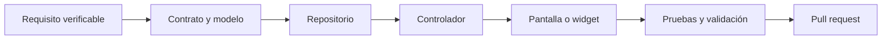

# Arquitectura del proyecto

## Propósito

Este documento define las responsabilidades técnicas de Cintli Montessori. Su
objetivo es que una modificación pueda localizarse, revisarse y probarse sin
depender de conocimiento informal del proyecto.

La arquitectura describe el estado real del repositorio. No presenta como
terminadas las funciones que continúan en planificación.

## Contexto del sistema

El producto atiende actualmente a una sola escuela y ofrece dos superficies:

- aplicación móvil para familias y docentes;
- panel web para personal administrativo autorizado.

Ambas superficies comparten modelos y acceso a Firebase, pero conservan puntos
de entrada y experiencias independientes.

## Capas y dependencias

### Presentación

Incluye pantallas, widgets y composición visual. Puede observar controladores y
enviarles acciones, pero no debe construir rutas de Firestore ni coordinar
escrituras relacionadas entre varias colecciones.

```text
lib/screens/
lib/academics/
lib/news/
lib/people/
lib/admin_web/presentation/
lib/features/*/presentation/
```

### Controladores

Los controladores mantienen el estado observable, coordinan cargas y cancelan
suscripciones. Deben exponer estados comprensibles para la interfaz: cargando,
datos, vacío y error.

Reglas:

- recibir repositorios por constructor;
- no depender de widgets ni de `BuildContext`;
- cancelar streams y temporizadores en `dispose`;
- evitar operaciones simultáneas que sobrescriban estado más reciente;
- convertir errores técnicos en estados que la presentación pueda comunicar.

### Repositorios

Los contratos declaran las operaciones requeridas por cada función. Las
implementaciones Firestore son responsables de rutas, consultas, serialización
y sincronización de copias de audiencia.

```text
lib/features/*/data/repositories/
lib/admin_web/data/
```

Una pantalla nueva debe consumir un repositorio o controlador existente. Si la
operación no existe, primero se amplía el contrato y después su implementación.

### Modelos

Los modelos convierten documentos externos en tipos utilizados por la
aplicación. Toda lectura procedente de Firebase debe aceptar datos incompletos o
históricos sin provocar una excepción innecesaria.

Los nombres de campos persistidos forman parte del contrato de datos. Cambiarlos
requiere compatibilidad o migración y pruebas de reglas.

### Núcleo compartido

`lib/core/` contiene infraestructura transversal: conectividad, monitoreo,
seguridad, tema, layout, constantes y widgets reutilizables. Este directorio no
debe importar módulos de negocio.

## Estado global

Provider administra únicamente estado compartido por varias rutas:

- `CurrentUserController`: sesión y perfil escolar vigente;
- `NetworkStatusController`: conectividad comprobada y reconexiones;
- `ThemeController`: preferencia local de tema;
- `AppState`: contexto académico seleccionado.

El estado temporal de formularios permanece dentro de su pantalla o componente.
No se debe crear un provider global para evitar pasar uno o dos parámetros.

## Contrato de datos

Cloud Firestore es la fuente principal. Las colecciones activas se encuentran
bajo:

```text
schools/{schoolId}/
```

El valor vigente es `default_school`. Debe obtenerse mediante
`AppConstants.defaultSchoolId`; no se permiten literales duplicados en pantallas
o repositorios.

| Dominio | Responsabilidad |
| --- | --- |
| `users` | Perfil, rol, estado y relaciones autorizadas |
| `groups` | Grupos escolares y orden de presentación |
| `students` | Información escolar utilizada por la aplicación |
| `teachers` | Docentes y grupos asignados |
| `subjects` | Materias, evaluación y grupos relacionados |
| `academicPeriods` | Periodos de evaluación disponibles |
| `evaluations` | Evaluaciones por estudiante, materia y periodo |
| `news` | Comunicados, vigencia y audiencia |
| `calendarEvents` | Eventos, fechas, horario y audiencia |

Firebase Storage almacena imágenes de comunicados. Realtime Database permanece
limitado al módulo heredado de personal. No se debe ampliar su uso ni migrar ese
módulo sin una decisión específica.

## Autorización y seguridad

La interfaz puede ocultar acciones, pero no constituye un control de seguridad.
Las reglas de Firebase deben comprobar autenticación, escuela, rol, estado de
cuenta y relación con el recurso.

Principios obligatorios:

- aplicar mínimo privilegio y denegar por defecto;
- no confiar en valores de rol enviados por el cliente;
- no registrar información personal en logs o Crashlytics;
- no incluir credenciales ni tokens en el repositorio;
- revisar código, reglas e índices cuando cambia una consulta.

App Check agrega una señal de legitimidad del cliente, pero no sustituye las
reglas ni la autorización. Su aplicación forzosa permanece fuera del alcance de
preproducción hasta validar las plataformas distribuidas.

## Flujo de una modificación



Un cambio puede omitir capas que no necesita. Una corrección visual no debe
modificar repositorios. La dirección de dependencias siempre debe conservarse.

## Comentarios técnicos

Los comentarios explican intención, restricciones, efectos secundarios o una
decisión que el código no puede comunicar por sí mismo. No repiten asignaciones,
no describen sintaxis y no conservan código deshabilitado.

Se utiliza `///` para clases y contratos públicos. Los comentarios internos
`//` se reservan para invariantes, compatibilidad, seguridad o motivos de
implementación no evidentes.

## Deuda técnica controlada

Algunas pantallas superan mil líneas porque todavía concentran composición,
formularios y componentes privados. No se deben reescribir de una sola vez. La
extracción se realizará por función, con pruebas visuales y sin combinarla con
cambios de comportamiento.

El módulo `lib/people/staff_screen.dart` continúa en Realtime Database y utiliza
estructuras dinámicas. Se mantiene aislado para una migración futura a modelos y
Firestore.

Los repositorios administrativos todavía son clases concretas. Cuando un módulo
requiera pruebas unitarias de lógica de negocio, se debe introducir primero un
contrato inyectable para ese módulo, no una abstracción global prematura.

## Incorporación de módulos

Antes de desarrollar un módulo nuevo se deben definir:

1. problema y usuarios responsables;
2. datos mínimos y tiempo de conservación;
3. permisos por rol;
4. estados y transiciones válidas;
5. comportamiento sin conexión;
6. métricas de aceptación;
7. pruebas y estrategia de reversión.

Cada módulo debe poder evolucionar sin cambiar pantallas o colecciones que no le
pertenecen.
