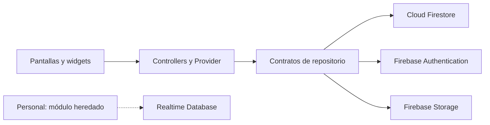

<div align="center">


# Cintli Montessori

Plataforma escolar en Flutter para familias, docentes y administración.


</div>

## Descripción

Cintli Montessori centraliza comunicación escolar, calendario, directorio y
seguimiento académico. El producto está compuesto por una aplicación móvil
para familias y docentes y un panel administrativo independiente en Flutter
Web.

El alcance actual corresponde a una sola escuela. El identificador
`default_school` es una decisión explícita del producto y no debe interpretarse
como una implementación multiinstitución.

> Este repositorio público se utiliza como portafolio y referencia técnica. No
> contiene credenciales, configuraciones privadas de Firebase ni datos reales
> de estudiantes, familias o personal.

## Estado del producto

| Superficie | Versión | Estado | Usuarios |
| --- | --- | --- | --- |
| Aplicación móvil | `0.9.0+1` | Preproducción | Familias y docentes |
| Panel administrativo web | `0.7.0+1` | Preproducción | Personal autorizado |

### Capacidades disponibles

- Autenticación y recuperación de contraseña mediante Firebase Authentication.
- Perfiles con acceso diferenciado para familias, docentes y administración.
- Noticias y calendario filtrados por audiencia y grupos relacionados.
- Directorio de grupos, estudiantes y docentes.
- Evaluaciones, boletas y estadísticas académicas.
- Administración web de noticias, eventos, grupos, materias y cuentas.
- Temas claro y oscuro, diseño adaptable y estados de conectividad.
- Crashlytics para fallos fatales de Android en compilaciones `release`.
- App Check integrado en Android y sin aplicación forzosa durante la
  preproducción.

### Capacidades no disponibles

- Administración general desde la aplicación móvil.
- Notificaciones push.
- Asistencia de estudiantes o personal.
- Transporte escolar con seguimiento en tiempo real.
- Distribución pública en Google Play o App Store.

Estas funciones requieren una decisión de alcance y no deben habilitarse solo
mediante cambios visuales o banderas locales.

## Arquitectura



Las vistas presentan estado, los controladores coordinan casos de uso y los
repositorios encapsulan el acceso a datos. Las reglas completas, dependencias
permitidas y deuda técnica conocida se documentan en
[ARCHITECTURE.md](ARCHITECTURE.md).

```text
lib/
├── admin_web/        Panel administrativo, repositorios, tema y widgets
├── core/             Servicios y componentes compartidos
├── features/         Auth, directorio, noticias, calendario y académicos
├── academics/        Composición de flujos académicos móviles
├── news/             Composición de comunicados móviles
├── people/           Directorio y módulo heredado de personal
├── screens/          Pantallas principales de la aplicación móvil
└── main.dart         Punto de entrada móvil
```

Puntos de entrada:

```text
lib/main.dart
lib/admin_web/main_admin.dart
```

## Requisitos

- Flutter compatible con Dart `^3.7.2`.
- Android Studio para desarrollo Android.
- Xcode para desarrollo iOS en macOS.
- Firebase CLI y FlutterFire CLI.
- Un proyecto Firebase de desarrollo propio.

## Configuración local

```bash
flutter pub get
flutterfire configure
```

La configuración debe generar localmente los siguientes archivos excluidos de
Git:

```text
.firebaserc
android/app/google-services.json
ios/Runner/GoogleService-Info.plist
macos/Runner/GoogleService-Info.plist
lib/core/config/firebase_options.dart
```

Nunca compartas credenciales mediante commits, issues o pull requests.

### Aplicación móvil

```bash
flutter run
```

### Panel administrativo

```bash
flutter run -d chrome -t lib/admin_web/main_admin.dart
```

App Check para web requiere una clave pública de reCAPTCHA Enterprise:

```bash
flutter run -d chrome -t lib/admin_web/main_admin.dart \
  --dart-define=FIREBASE_APP_CHECK_WEB_SITE_KEY=TU_CLAVE_PUBLICA
```

Durante la preproducción, App Check debe permanecer sin aplicación forzosa en
Firebase Console. Los tokens de depuración son locales y nunca se versionan.

## Validación

Antes de abrir un pull request ejecuta:

```bash
dart format --output=none --set-exit-if-changed lib test
flutter analyze --fatal-infos --fatal-warnings
flutter test
flutter build apk --debug
```

Cuando se modifica el panel web, agrega:

```bash
flutter build web --release -t lib/admin_web/main_admin.dart
```

La integración continua repite análisis, pruebas y compilación Android en cada
pull request dirigido a `main`.

## Colaboración

Toda modificación debe realizarse en una rama y llegar a `main` mediante pull
request. La guía de arquitectura, comentarios, commits, validación y definición
de terminado se encuentra en [CONTRIBUTING.md](CONTRIBUTING.md).

Los reportes de vulnerabilidades siguen el proceso privado descrito en
[SECURITY.md](SECURITY.md).

## Próximos objetivos

- Distribuir compilaciones internas mediante Firebase App Distribution.
- Ampliar pruebas de controladores, repositorios y flujos críticos.
- Validar reglas con Firebase Emulator Suite y datos ficticios.
- Extraer componentes y lógica de pantallas que aún concentran varias
  responsabilidades.
- Incorporar un backend privilegiado antes de automatizar operaciones sensibles
  sobre cuentas de Firebase Authentication.
- Evaluar Performance Monitoring, Remote Config y Cloud Messaging como cambios
  independientes y con métricas de aceptación.

## Autor y licencia

Diseño, arquitectura y desarrollo por [Luis Cruz](https://github.com/cruzlcdev).

Contacto profesional: [luisitprivt@gmail.com](mailto:luisitprivt@gmail.com).

Copyright (c) 2026 Luisdev. Todos los derechos reservados. Consulta
[LICENSE](LICENSE) para conocer las restricciones de uso.
