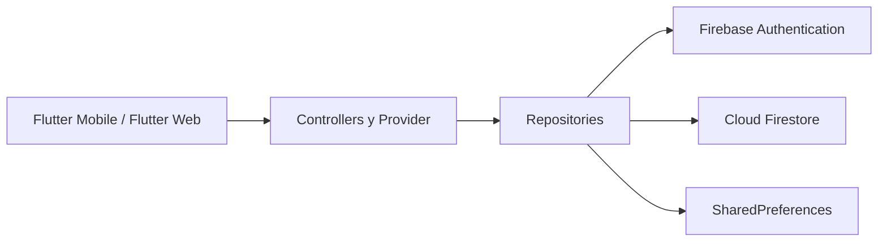

<div align="center">


# Cintli Montessori

### Plataforma escolar multiplataforma para familias, docentes y administración


</div>

## Visión general

Cintli Montessori es un sistema de gestión escolar compuesto por una aplicación móvil para familias y docentes y un panel administrativo desarrollado con Flutter Web. Centraliza comunicación, calendario, directorio académico, evaluaciones y operación institucional mediante una arquitectura modular conectada a Firebase.

El proyecto evolucionó de un prototipo académico a una base orientada a producción. Su diseño prioriza experiencia adaptable, control de acceso por rol, separación de responsabilidades y aislamiento de la información por institución.

> Este repositorio es una versión pública de portafolio. No contiene credenciales, configuraciones Firebase por plataforma, cuentas de servicio ni datos personales de estudiantes, familias o personal.

## Alcance actual

| Producto | Usuarios | Capacidades principales | Versión |
| --- | --- | --- | --- |
| Aplicación móvil | Familias y docentes | Noticias, calendario, directorio, boletas, estadísticas, evaluaciones y configuración | `0.9.0+1` |
| Panel administrativo web | Personal autorizado | Dashboard, noticias, calendario, grupos, materias, alumnos, familias y profesores | `0.7.0+1` |

**Etapa:** preproducción y validación funcional.

La administración móvil permanece deshabilitada; la gestión institucional se concentra en el panel web. Las notificaciones push y Firebase Storage forman parte del roadmap y no se presentan como funciones activas.

## Capacidades destacadas

### Aplicación móvil

- Autenticación con Firebase y perfil de usuario observado en tiempo real.
- Experiencias diferenciadas para familias y docentes.
- Noticias y calendario filtrados por audiencia y grupos relacionados.
- Consulta de boletas, estadísticas y periodos académicos.
- Registro docente de evaluaciones dentro de grupos y materias autorizados.
- Modo claro y oscuro con preferencia persistente.
- Layout adaptable para iOS y Android.
- Estados de carga, manejo de conectividad y mensajes de error para el usuario.
- Recuperación de contraseña y control de cuentas inactivas.

### Panel administrativo web

- Dashboard con indicadores operativos.
- Gestión de noticias, audiencias, expiración y archivado.
- Administración de calendario, fechas, horarios y grupos destinatarios.
- Gestión de grupos, materias, alumnos, familias y profesores.
- Vinculación de docentes con grupos y de familias con estudiantes.
- Aprovisionamiento controlado de cuentas Firebase Authentication.
- Activación, inactivación y confirmaciones para acciones críticas.
- Tema claro, oscuro o basado en el sistema.
- Formularios y componentes diseñados para operación en escritorio.

## Arquitectura



La aplicación sigue una organización modular por funcionalidad:

```text
lib/
├── admin_web/            Panel administrativo, datos, presentación y tema
├── core/                 Configuración, conectividad, layout, tema y widgets
├── features/
│   ├── academics/        Periodos, materias y evaluaciones
│   ├── auth/             Sesión, perfiles y recuperación de acceso
│   ├── calendar/         Eventos y audiencias
│   ├── directory/        Grupos, estudiantes y profesores
│   └── news/             Comunicados y audiencias
├── screens/              Composición de pantallas móviles
└── main.dart             Punto de entrada de la aplicación móvil
```

El panel administrativo utiliza un punto de entrada independiente:

```text
lib/admin_web/main_admin.dart
```

### Decisiones técnicas

- **Cloud Firestore como fuente principal:** los módulos activos consumen colecciones y streams de Firestore.
- **Separación por institución:** la información se organiza bajo `schools/{schoolId}`.
- **Acceso por rol:** los perfiles y reglas contemplan usuarios autorizados, estado de cuenta y relaciones con grupos o estudiantes.
- **Repositorios desacoplados:** la interfaz depende de controladores y contratos de datos, no de consultas dispersas en los widgets.
- **Dos superficies, un stack:** móvil y administración comparten Flutter, Dart, modelos y criterios visuales.

## Stack tecnológico

| Área | Tecnología |
| --- | --- |
| Móvil | Flutter y Dart |
| Administración | Flutter Web |
| Autenticación | Firebase Authentication |
| Datos | Cloud Firestore |
| Estado | Provider |
| Preferencias | SharedPreferences |
| Calendario | table_calendar |
| Conectividad | connectivity_plus |
| Localización | intl y flutter_localizations |
| Interfaz | Material Design, lucide_flutter y skeletonizer |

`firebase_database`, `firebase_storage` e `image_picker` permanecen como dependencias de transición o preparación futura. Su presencia no implica que esos servicios formen parte de todos los flujos productivos actuales.

## Configuración local segura

### Requisitos

- Flutter compatible con Dart `^3.7.2`.
- Xcode para desarrollo iOS.
- Android Studio para desarrollo Android.
- Un proyecto Firebase propio.
- FlutterFire CLI y Firebase CLI.

### Preparación

```bash
flutter pub get
flutterfire configure
```

`flutterfire configure` debe generar localmente los archivos excluidos del repositorio:

```text
android/app/google-services.json
ios/Runner/GoogleService-Info.plist
macos/Runner/GoogleService-Info.plist
lib/core/config/firebase_options.dart
.firebaserc
```

No deben añadirse configuraciones reales, llaves privadas o cuentas de servicio a commits públicos.

### Ejecutar la aplicación móvil

```bash
flutter run
```

### Ejecutar el panel administrativo

```bash
flutter run -d chrome -t lib/admin_web/main_admin.dart
```

## Firebase y seguridad

El repositorio conserva únicamente artefactos públicos y revisables:

- `firestore.rules`
- `firestore.indexes.json`
- `storage.rules`
- `firebase.json` sin identificadores de proyecto
- `.firebaserc.example`

La seguridad no depende únicamente de validaciones visuales. Antes de producción deben configurarse y validarse reglas, App Check, entornos separados, respaldos, alertas de consumo y permisos con Firebase Emulator Suite.

## Calidad

Comandos principales de validación:

```bash
flutter analyze
flutter test
flutter build web --release -t lib/admin_web/main_admin.dart
```

La revisión previa a publicación debe incluir:

- ausencia de secretos y configuraciones locales;
- pruebas de reglas con usuarios y roles ficticios;
- navegación para familias, docentes y cuentas inactivas;
- sincronización de streams y estados sin conexión;
- layouts móviles y web en múltiples resoluciones;
- consistencia del versionado móvil y administrativo.

## Privacidad

- No se deben registrar datos reales de estudiantes en issues, pruebas o commits.
- Las cuentas de servicio nunca deben integrarse en Flutter ni publicarse.
- Los documentos operativos internos se mantienen fuera del repositorio.
- Las demostraciones deben utilizar información ficticia.
- Los hallazgos de seguridad deben comunicarse de forma privada.

Las capturas de entornos institucionales no se incluyen públicamente para evitar exponer identidades, datos académicos o configuraciones del cliente.

## Roadmap

- Completar pruebas integrales con Firebase Emulator Suite.
- Definir App Check, monitoreo, respaldos y alertas de consumo.
- Incorporar un backend privilegiado para operaciones administrativas sobre cuentas Auth.
- Habilitar Storage cuando exista una política de contenido, privacidad y costos.
- Integrar Firebase Cloud Messaging después de definir consentimiento y audiencias.
- Preparar distribución cerrada mediante TestFlight y Google Play Testing.
- Ejecutar pruebas de aceptación con datos completamente ficticios.

## Autor y contacto

Diseño, arquitectura y desarrollo por [Luis Cruz](https://github.com/cruzlcdev).

Para proyectos, colaboración profesional o contratación: [luisitprivt@gmail.com](mailto:luisitprivt@gmail.com).

## Licencia

Copyright (c) 2026 Luisdev. Todos los derechos reservados.

Este software es propietario y se publica únicamente con fines demostrativos y de portafolio. Consulta [LICENSE](LICENSE) para conocer las restricciones de uso.
